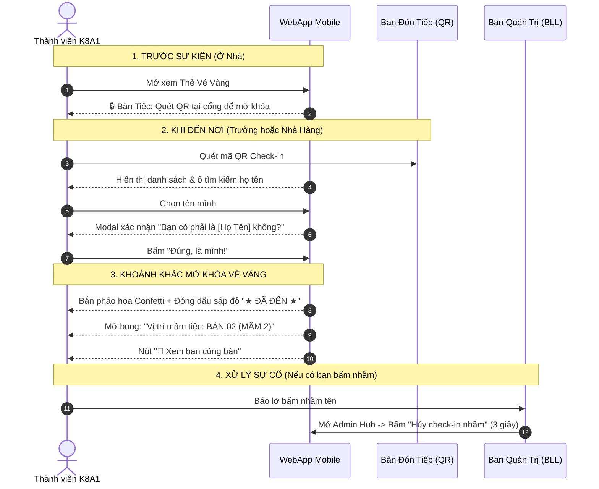

# KẾ HOẠCH TRIỂN KHAI TÍNH NĂNG
# "VÉ VÀNG PHÂN BÀN TIỆC K8A1" (5 BÀN HỌC SINH + 1 MÂM THẦY CÔ)
**Dự án**: WebApp Hội Ngộ 20 Năm Lớp K8A1 — Trường THPT Thái Nguyên (2003 — 2006)  
**Thời gian sự kiện**: Chủ Nhật, 27/09/2026 (08:30 — 15:30)  
**Tài liệu lưu trữ**: `KE_HOACH_PHAN_BAN_TIEC_K8A1.md`

---

## I. BỐI CẢNH & MỤC TIÊU CỐT LÕI

### 1. Vấn đề thực tế
Trong các buổi họp lớp sau 20 năm, một phản xạ tự nhiên của mọi người là tìm những bạn hay chơi thân hoặc hay gặp gỡ để rủ nhau ngồi chung một mâm. Điều này dẫn đến:
- Hình thành các "nhóm nhỏ" (cliques) khép kín, cô lập.
- Những bạn ở xa về, những bạn ít online hoặc ít nói chuyện trên nhóm Zalo sẽ cảm thấy bị ngượng ngùng, bơ vơ và lạc lõng.
- Mất đi ý nghĩa thiêng liêng nhất của ngày hội ngộ 20 năm: **Gắn kết toàn thể đại gia đình K8A1, sống lại thời vô tư tuổi học trò, xóa nhòa mọi khoảng cách thời gian và hoàn cảnh sống**.

### 2. Mục tiêu giải pháp
- **Không dùng mệnh lệnh hành chính khô cứng**: Biến việc xếp chỗ thành một **trải nghiệm học trò thú vị, hồi hộp và bất ngờ** (hình thức bốc thăm / Vé Vàng may mắn).
- **Triệt tiêu việc rủ rê chia nhóm trước ở nhà**: Khi ở nhà, số bàn tiệc hoàn toàn được bảo mật. Chỉ khi thành viên quét mã QR Check-in thì tấm Thẻ Vé Vàng mới mở bung số bàn.
- **Tự nhiên và thoải mái**: Mọi người đều vui vẻ đón nhận vị trí mâm tiệc của mình như một "món quà cơ duyên của 20 năm thanh xuân".

---

## II. QUY MÔ & CƠ CẤU BÀN TIỆC

Tổng cộng gồm **6 bàn tiệc** tại Trung Tâm Sự Kiện / Nhà Hàng (Chặng 2):

| Bàn / Mâm | Đối tượng phục vụ | Sức chứa tiêu chuẩn | Tiêu chí phân bổ |
| :--- | :--- | :--- | :--- |
| **🎓 Mâm Danh Dự** | **Quý Thầy Cô Giáo** | 10 — 12 chỗ | Dành riêng tôn vinh Quý Thầy Cô giáo chủ nhiệm và bộ môn, cùng 1-2 đại diện Ban Liên Lạc tiếp đón, chăm sóc. |
| **🍽️ Bàn 01 (Mâm 1)** | Học sinh K8A1 | 10 bạn | Cân bằng Nam/Nữ (~5 Nam, ~5 Nữ) + 1 thành viên BLL làm hạt nhân kết nối. |
| **🍽️ Bàn 02 (Mâm 2)** | Học sinh K8A1 | 10 bạn | Cân bằng Nam/Nữ (~5 Nam, ~5 Nữ) + 1 thành viên BLL làm hạt nhân kết nối. |
| **🍽️ Bàn 03 (Mâm 3)** | Học sinh K8A1 | 10 bạn | Cân bằng Nam/Nữ (~5 Nam, ~5 Nữ) + 1 thành viên BLL làm hạt nhân kết nối. |
| **🍽️ Bàn 04 (Mâm 4)** | Học sinh K8A1 | 10 bạn | Cân bằng Nam/Nữ (~5 Nam, ~5 Nữ) + 1 thành viên BLL làm hạt nhân kết nối. |
| **🍽️ Bàn 05 (Mâm 5)** | Học sinh K8A1 | 10 bạn | Cân bằng Nam/Nữ (~5 Nam, ~5 Nữ) + 1 thành viên BLL làm hạt nhân kết nối. |

> **Tổng sức chứa học sinh**: 5 bàn x 10 người = 50 chỗ (hoàn toàn đáp ứng đủ cho sỹ số lớp 43-45 bạn + các trường hợp dẫn theo người thân / dự phòng).

---

## III. KỊCH BẢN VẬN HÀNH CHECK-IN (1 LẦN DUY NHẤT XUYÊN SUỐT)

### 1. Nguyên tắc "Check-in 1 lần duy nhất trong ngày"
Cổng Check-in trên WebApp hoạt động linh hoạt xuyên suốt cả ngày hội ngộ:
- **Bạn đến trường từ sáng (08:30 tại Chặng 1)**: Quét mã QR tại cổng trường để điểm danh, nhận áo polo K8A1 mặc chụp ảnh tập thể, đồng thời Thẻ Vé Vàng mở khóa hiển thị số mâm trưa.
- **Bạn bận việc sáng, chỉ đến nhà hàng (11:30 tại Chặng 2)**: Quét mã QR tại sảnh đón tiếp nhà hàng để điểm danh, nhận áo polo (nếu chưa lấy) và xem số mâm tiệc của mình.
- **Bạn chỉ đến trường rồi về sớm**: Vẫn được ghi nhận điểm danh có mặt và nhận áo polo kỷ niệm chu đáo.
- **Không bắt ai phải check-in 2 lần**: Hệ thống ghi nhận trạng thái đã đến, sang nhà hàng chỉ việc vào thẳng mâm thưởng thức tiệc.

### 2. Xác nhận danh tính 1-chạm (Không dùng SĐT)
- **Lý do bỏ xác thực SĐT**: Danh bạ 20 năm có nhiều số cũ, số phụ hoặc bạn mới đổi số chưa kịp cập nhật. Nếu bắt nhập SĐT sẽ gây tắc nghẽn bàn lễ tân và làm mất vui.
- **Giải pháp thay thế**:
  - Khi chạm vào tên mình trong danh sách lớp, màn hình bật lên hộp thoại xác nhận to, rõ ràng:
    > *"Bạn có phải là **[HỌ VÀ TÊN]** (Biệt danh: **[TÊN THƯỜNG GỌI]**) không?"*  
    > `[ ✅ Đúng, là mình! ]`        `[ ❌ Bấm nhầm, chọn lại ]`
  - Nhấn xác nhận trong đúng 1 giây là xong, ngăn chặn 99% trường hợp tay bấm trượt sang tên người khác.

---

## IV. TRẢI NGHIỆM THÀNH VIÊN TRÊN WEBAPP (USER JOURNEY)

### 1. Trạng thái Chưa Check-in (`checkedIn = false`)
- Trên Thẻ Vé Vàng (`LiveGoldenPass` và `StudentPassModal`):
  - Ô vị trí bàn tiệc hiển thị:  
    `🔒 Bàn tiệc: 🎁 Phong Bao Bí Mật (Quét QR tại cổng đón tiếp để mở khóa)`
  - Hoàn toàn ẩn số bàn, đảm bảo bí mật 100%.

### 2. Trạng thái Đã Check-in (`checkedIn = true`)
- Ngay khi bấm xác nhận có mặt:
  - Hiệu ứng pháo hoa giấy Confetti bùng nổ.
  - Con dấu sáp đỏ cổ điển K8A1 in dấu: `★ ĐÃ ĐẾN ★ [Giờ đến]`.
  - Ô bàn tiệc mở ra huy hiệu ánh kim (Golden Shimmer):
    - Học sinh: `🍽️ Bàn 02 (Mâm 2)`
    - Thầy cô: `🎓 Mâm Tri Ân Quý Thầy Cô`
  - Nút bấm `[ 👥 Xem bạn cùng bàn ]`: Mở popup xem danh sách các bạn cùng mâm với mình (kèm ảnh đại diện, biệt danh và trạng thái Đã đến / Đang tới).

---

## V. THUẬT TOÁN PHÂN BÀN THÔNG MINH (BTC KIỂM SOÁT)

Thuật toán `autoAssignStudentTables` chạy ngầm trong Admin Hub:

1. **Rải đều Ban Liên Lạc (Hạt nhân kết nối)**:
   - Các bạn thuộc Ban Liên Lạc (Lớp trưởng, Lớp phó, Bí thư, Thủ quỹ...) được rải đều vào 5 bàn (mỗi bàn có 1-2 BLL).
   - Đóng vai trò "Bàn trưởng" chủ động khui đồ uống, rót nước, gợi mở câu chuyện cho các bạn ít nói.
2. **Cân bằng tỷ lệ Nam / Nữ**:
   - Tự động đếm và rải đều các bạn Nam và Nữ vào 5 bàn, tránh cảnh bàn toàn nam uống bia ồn ào, bàn toàn nữ ngồi trầm ngâm.
3. **Cố tình tách các nhóm hay đi chung thường ngày**:
   - Những bạn thường xuyên gặp nhau cà phê hàng tuần được xếp khác bàn để 20 năm mới có một dịp họ trò chuyện, hàn huyên cùng những người bạn cũ xa quê.
4. **Quyền ghi đè linh hoạt của Admin**:
   - Admin có dropdown chọn chuyển bàn bất kỳ ai chỉ với 1 chạm (ví dụ bạn dẫn theo vợ/chồng, con cái cần ngồi bàn rộng hơn).

---

## VI. BẢO MẬT & XỬ LÝ TÌNH HUỐNG PHÁT SINH

### 1. Không thể tự ghi đè bừa bãi
- Một khi thành viên đã check-in thành công, nút *"Xác nhận điểm danh"* sẽ tự động biến mất và thay thế bằng con dấu đã đến.
- Thành viên không có quyền tự đổi số bàn trên điện thoại (chỉ có quyền xem).

### 2. Quyền sửa lỗi thuộc về Ban Tổ Chức (Admin Hub)
- Nếu có bạn vội vàng bấm nhầm tên bạn khác:
  - Thành viên báo ngay cho bạn trực bàn Lễ tân / BLL.
  - Admin mở WebApp trên điện thoại, vào `AdminManagementHub` (bảo vệ bằng mã PIN bảo mật).
  - Bấm nút **"Hủy check-in nhầm"** để trả người bị bấm nhầm về trạng thái "Chưa đến".
  - Bấm check-in đúng lại cho bạn kia. Thao tác hoàn tất trong 3 giây!

### 3. Về cấu trúc Google Sheets
- **Không bắt buộc sửa tay bất kỳ cột nào**: Hệ thống tự động lưu trữ và đồng bộ an toàn qua các trường metadata có sẵn của `Trang_tinh_1` và `Danh_Sach_Lop`.
- Nếu thêm cột mới `Bàn Số` (Cột 18), Apps Script sẽ tự động kiểm tra và khởi tạo tiêu đề, người dùng không cần can thiệp kỹ thuật.

---

## VII. DANH MỤC CÁC FILE MÃ NGUỒN SẼ THỰC HIỆN

Khi bạn sẵn sàng bấm nút triển khai, hệ thống sẽ thực hiện cập nhật trên các file sau:

1. `src/types.ts`: Bổ sung kiểu dữ liệu `tableNumber`, `tableName` và `seatingConfig`.
2. `src/data.ts`: Bổ sung cấu hình 5 bàn + 1 mâm thầy cô và thuật toán phân bàn cân bằng `autoAssignStudentTables`.
3. `src/components/LiveGoldenPass.tsx`: Bổ sung ô hiển thị bàn tiệc (ổ khóa bí mật trước check-in và bung mở sau check-in).
4. `src/components/StudentPassModal.tsx`: Đồng bộ vị trí bàn tiệc trên thẻ Vé Vàng đầy đủ kích thước và ảnh xuất JPG.
5. `src/components/SelfCheckinPage.tsx`: Bổ sung Modal xác nhận danh tính 1 chạm (không cần SĐT) và thông báo chúc mừng vị trí mâm tiệc.
6. `src/components/TableMembersModal.tsx` *(Mới)*: Modal hiển thị danh sách các thành viên cùng bàn tiệc.
7. `src/components/AdminManagementHub.tsx`: Thêm phân hệ Quản lý & Điều phối Xếp Bàn (5 Bàn Học Sinh + 1 Mâm Thầy Cô).

---
*Tài liệu này được lưu trữ chính thức trong thư mục dự án để sẵn sàng kích hoạt bất cứ lúc nào.*
